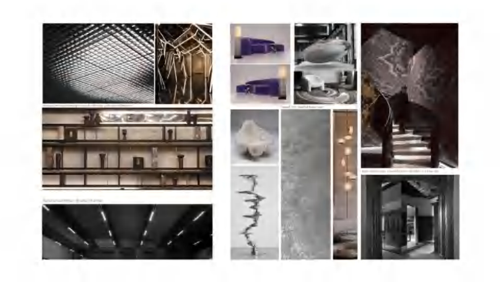
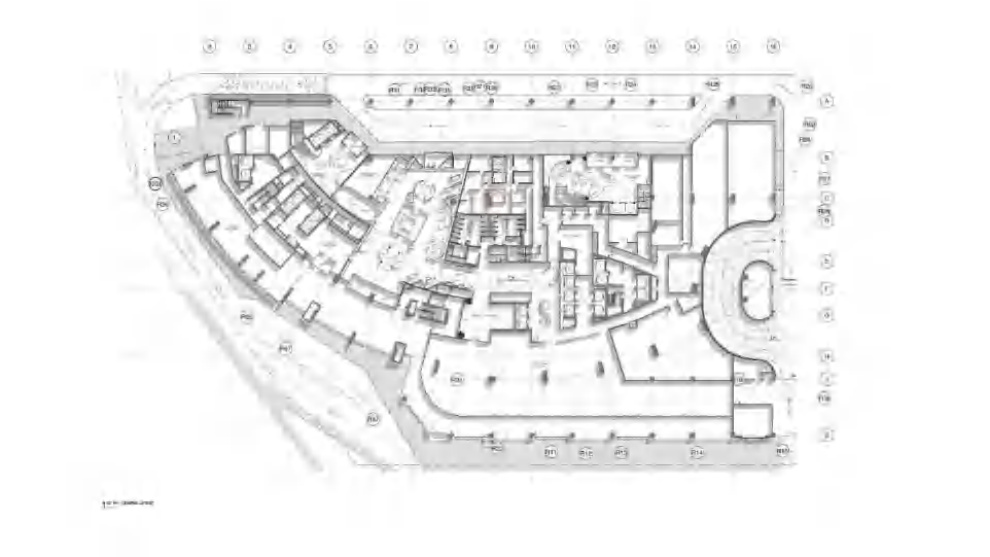
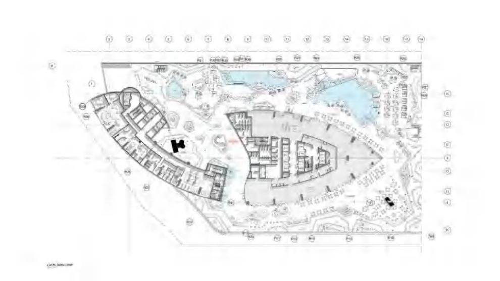
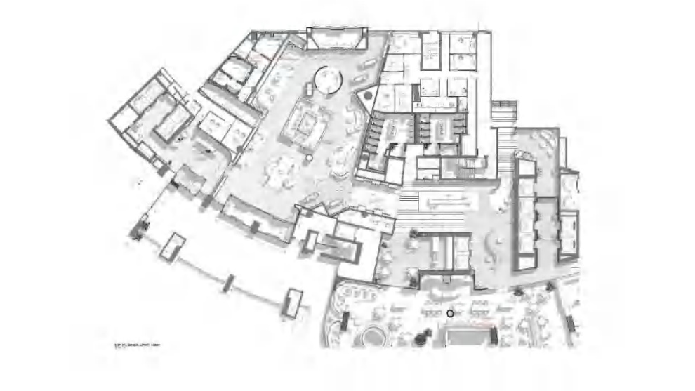
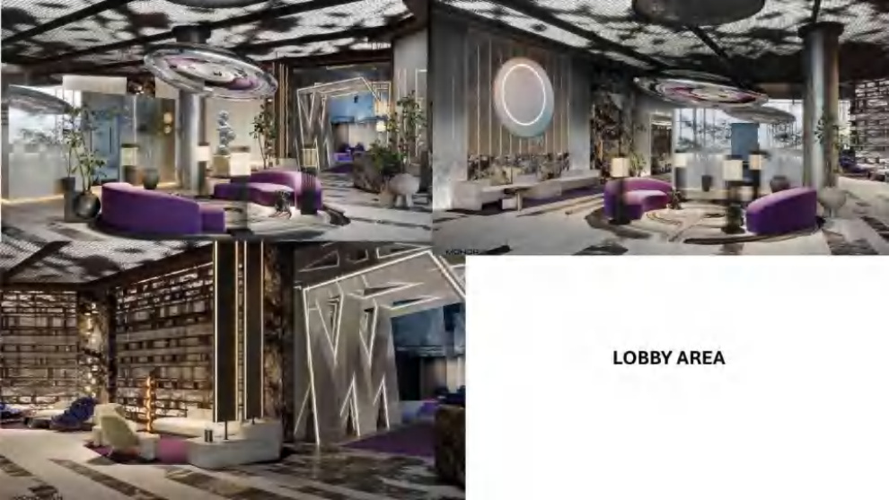
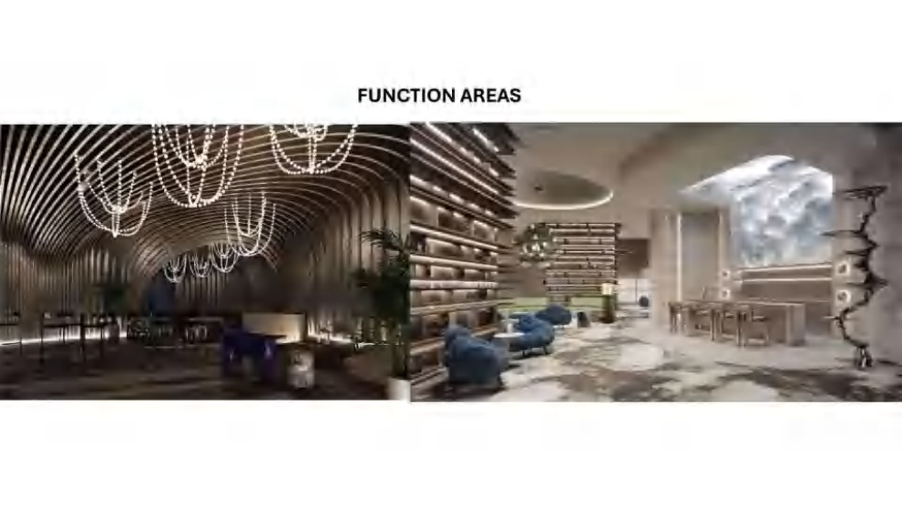
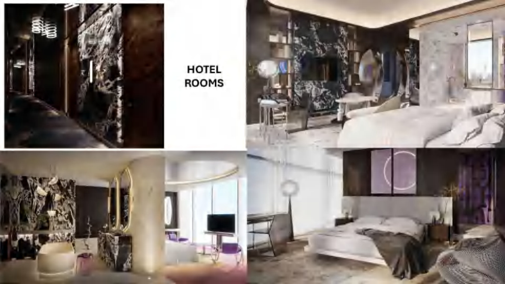
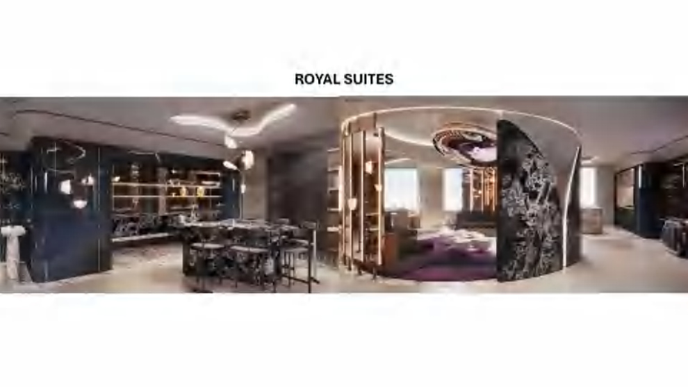
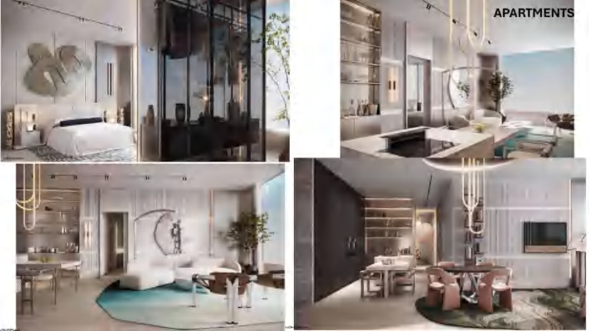

# Hospitality Interior Design

## Spatial Planning | Hospitality Interiors | Hotel Rooms | Suites | Apartments

A selection of hospitality interior design work demonstrating the development of interiors from spatial planning and design development through to visualisation.

## Project Overview

This project showcases hospitality interiors across a range of spaces, including:

- Spatial planning and floor plan development
- Lobby and arrival areas
- Function and guest areas
- Hotel rooms
- Royal suites
- Apartment interiors
- Interior design development
- Material and furniture direction
- 3D visualisation
- Design presentation

## Design Approach

The design process focuses on creating cohesive hospitality environments through the integration of **spatial planning, materiality, lighting, furniture, architectural elements and the guest experience**.

The selected work demonstrates the development of both public hospitality spaces and private guest accommodation.

## Selected Visuals

### Design Inspiration

### Overall Floor Plan

### Site & Landscape Plan

### Spatial Plan

### Lobby Area

### Function Areas

### Hotel Rooms

### Royal Suites

### Apartments

## My Contribution

Senior Interior Designer — spatial planning, design development, interior design, material direction, visualisation and technical coordination.

## Software

- Autodesk Revit
- AutoCAD
- SketchUp
- Lumion
- Adobe Photoshop
- Adobe InDesign
- Keynote

---

*Selected professional work — showcased with permission.*
